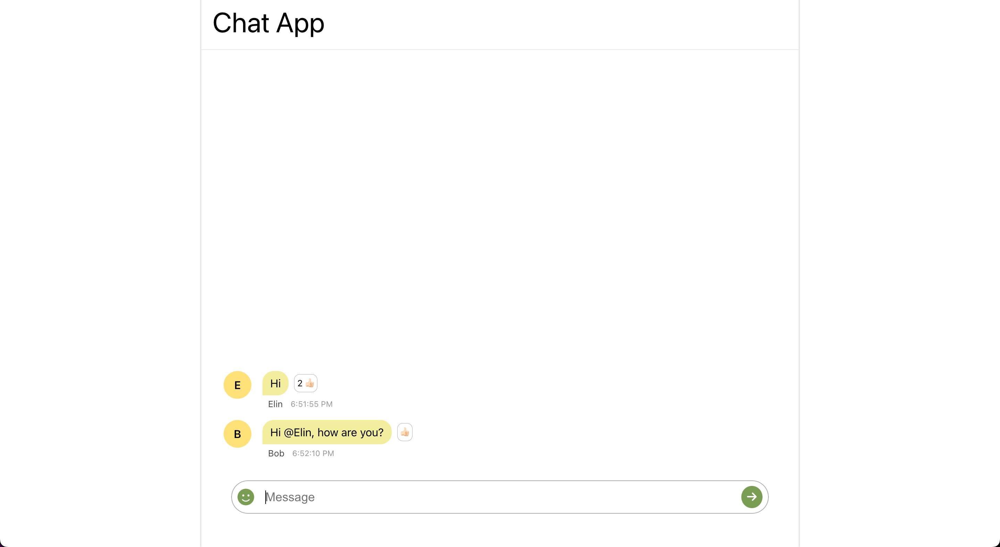
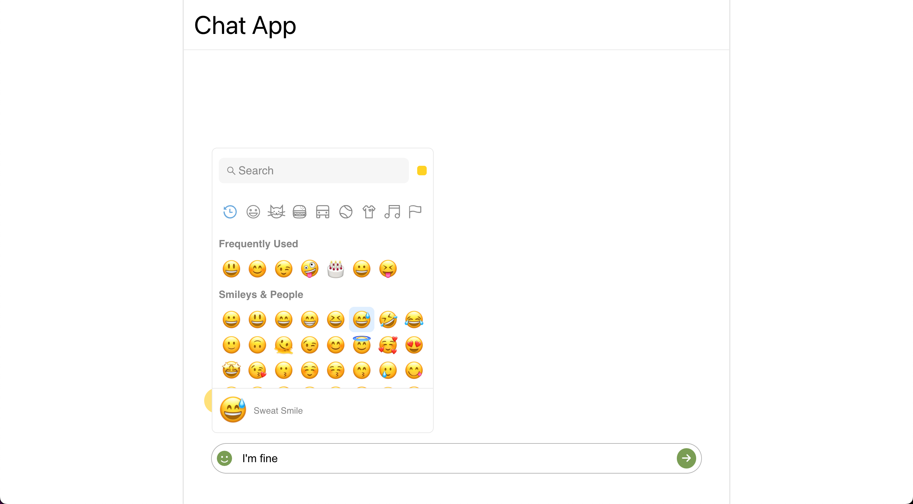
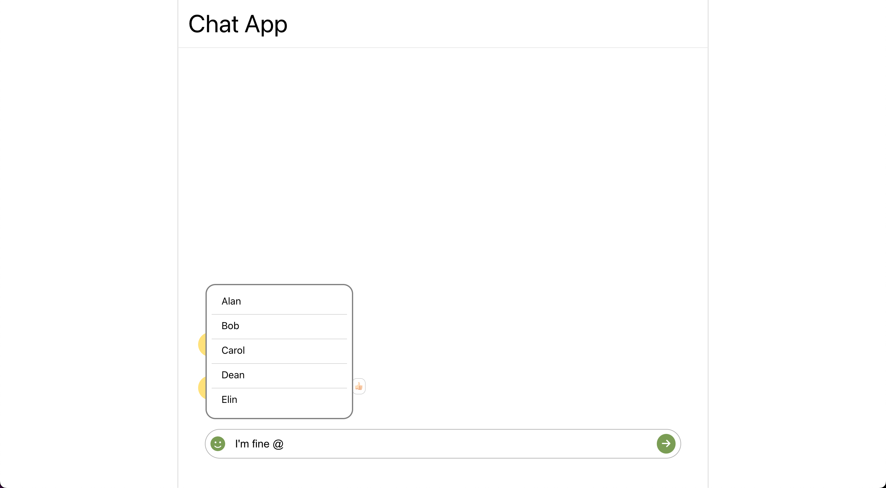

# React Chat Application

[Live URL](https://acgeoffrey.github.io/react-chat-app/)

## Features

- This is a simple single page application, which has a text box and a button to send the chat.
- On clicking the button, the messages will be shown in the chat container above the input box.
- For each message, the users are randomly assigned from a list of users.
- Like button next to the messages which will increase the like count.
- There is a emoji menu to send emojis in the chat.
- There is a mention(@) feature, on typing '@' the list of users are shown from the users list as we type.

## Screenshots

